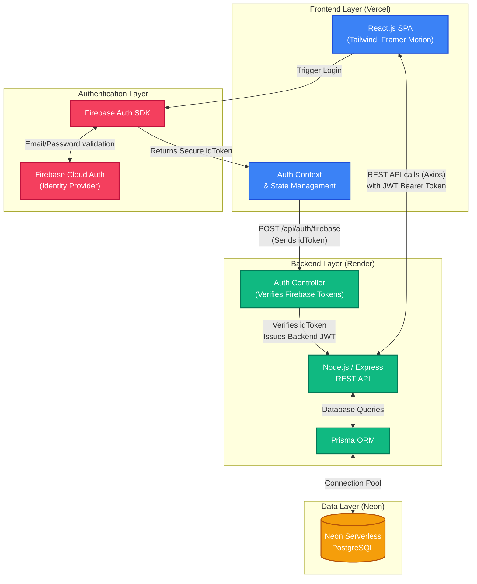

# GoalSync AI Architecture

Below is the complete system architecture diagram for your submission. You can copy the code block below into [Mermaid Live Editor](https://mermaid.live/) to export it as a high-quality PDF or Image for your submission!

