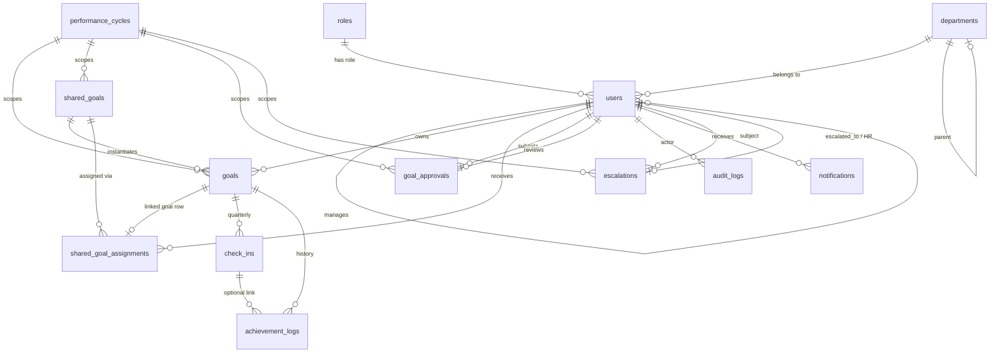

# GoalSync AI — Database Schema Design

Normalized **Third Normal Form (3NF)** PostgreSQL schema for enterprise goal management, with explicit foreign keys, cascade policies, and indexes aligned to application access patterns.

---

## Entity Relationship Overview



### Relationship narrative

| From | To | Cardinality | Purpose |
|------|-----|-------------|---------|
| **roles** | **users** | 1:N | RBAC; `ON DELETE RESTRICT` prevents deleting a role in use |
| **departments** | **users** | 1:N | Org assignment; optional `parent_id` for hierarchy |
| **users** | **users** | 1:N (`manager_id`) | Reporting line; `SET NULL` if manager leaves |
| **performance_cycles** | **goals**, **shared_goals**, **goal_approvals** | 1:N | Time-bounds all goal activity |
| **shared_goals** | **shared_goal_assignments** | 1:N | Template → many employees |
| **shared_goal_assignments** | **goals** | 1:1 (optional) | Each assignment materializes one editable goal row |
| **users** | **goal_approvals** | 1:1 per cycle | One approval workflow per employee per cycle (`UNIQUE user_id, cycle_id`) |
| **goals** | **check_ins** | 1:4 max | One row per quarter (`UNIQUE goal_id, quarter`) |
| **goals** | **achievement_logs** | 1:N | Append-only change history |
| **audit_logs** | — | — | Denormalized `entity_type` + `entity_id`; **no FK** to targets so deletes never remove audit trail |

---

## Normalization (3NF)

| Table | 3NF rationale |
|-------|----------------|
| **roles** | Role names live once; not repeated on `users` |
| **departments** | Department attributes separated from users |
| **users** | No transitive deps; manager is FK, not duplicated name/email |
| **performance_cycles** | Cycle dates/names not copied onto every goal |
| **shared_goals** | KPI definition once; assignments hold per-user weightage only |
| **goals** | Per-employee instance; shared metadata referenced by `shared_goal_id` |
| **shared_goal_assignments** | Junction + weightage (M:N between template and users) |
| **goal_approvals** | Sheet-level workflow separate from line-item **goals** |
| **check_ins** | Quarterly facts depend only on `goal_id` + `quarter` key |
| **achievement_logs** | Historical facts; no derived aggregates stored |
| **audit_logs** | Event store; JSONB for flexible before/after payloads |
| **notifications** | Delivery channel separate from business entities |
| **escalations** | Workflow state machine separate from goals |

**Deliberate denormalization:** `goals.is_shared` flag mirrors `shared_goal_id IS NOT NULL` for fast filtering (constrained by `chk_goals_shared_flag`).

---

## Foreign Key & Cascade Strategy

| Child table | Parent | ON DELETE | Rationale |
|-------------|--------|-----------|-----------|
| users | roles | **RESTRICT** | Cannot delete role with active users |
| users | departments | **SET NULL** | User remains if dept removed |
| users | users (manager) | **SET NULL** | Orphan reports if manager deleted |
| goals | users | **CASCADE** | Goals belong to employee lifecycle |
| goals | performance_cycles | **RESTRICT** | Prevent deleting active cycle with data |
| goals | shared_goals | **SET NULL** | Keep goal if template retired |
| shared_goal_assignments | shared_goals | **CASCADE** | Remove assignments with template |
| shared_goal_assignments | users | **CASCADE** | Remove assignments with user |
| shared_goal_assignments | goals | **SET NULL** | Keep assignment metadata if goal removed |
| goal_approvals | users | **CASCADE** | Approvals tied to employee |
| check_ins | goals | **CASCADE** | Check-ins die with goal |
| achievement_logs | goals | **CASCADE** | Logs tied to goal |
| achievement_logs | check_ins | **SET NULL** | Preserve log if check-in row pruned |
| audit_logs | users | **SET NULL** | **Never delete audit** when user removed |
| notifications | users | **CASCADE** | In-app only; safe to purge with user |
| escalations | users | **CASCADE** | Subject user removed |
| escalations | escalated_to / HR | **SET NULL** | Escalation remains open/historical |

---

## Indexing Strategy

### B-tree (equality & range)

| Index | Table | Columns | Query pattern |
|-------|-------|---------|---------------|
| `idx_users_manager_id` | users | `manager_id` (partial) | Manager team list |
| `idx_goals_user_cycle` | goals | `user_id, cycle_id` | Employee goal sheet |
| `idx_goals_cycle_status` | goals | `cycle_id, status` | Org-wide status reports |
| `idx_goal_approvals_reviewer_status` | goal_approvals | `reviewer_id, status` (partial pending) | Manager approval inbox |
| `uq_goal_approvals_user_cycle` | goal_approvals | `user_id, cycle_id` | Enforce one sheet per cycle |
| `idx_check_ins_goal` | check_ins | `goal_id` | Quarterly UI per goal |
| `idx_achievement_logs_goal` | achievement_logs | `goal_id, created_at DESC` | Timeline per goal |

### Partial indexes (smaller, faster hot paths)

```sql
-- Only active users
idx_users_active ON users(is_active) WHERE is_active = TRUE

-- Draft goals for editing UI
idx_goals_user_draft ON goals(user_id) WHERE status = 'draft'

-- Unread notification bell
idx_notifications_user_unread ON notifications(user_id, created_at DESC) WHERE is_read = FALSE

-- Open escalations dashboard
idx_escalations_status ON escalations(status) WHERE status IN ('open', 'in_progress')
```

### BRIN (time-series audit)

```sql
idx_audit_logs_created_brin ON audit_logs USING brin(created_at)
```

Use for admin audit screens filtered by date range on large tables (cheap storage, fast sequential scans).

### GIN (JSONB & text search)

```sql
idx_audit_logs_new_values_gin ON audit_logs USING gin(new_values jsonb_path_ops)
idx_users_name_trgm ON users USING gin ((first_name || ' ' || last_name) gin_trgm_ops)
```

- **jsonb_path_ops:** containment queries on audit diffs  
- **pg_trgm:** user search by name in admin UI  

### Unique / exclusion

| Constraint | Purpose |
|------------|---------|
| `uq_performance_cycles_active` | One active cycle globally |
| `uq_check_ins_goal_quarter` | One check-in per goal per quarter |
| `uq_shared_goal_assignments_user` | One assignment per user per shared KPI |
| `chk_users_not_self_manager` | Prevent circular hierarchy |

---

## Shared Goal Mapping Flow

```
1. Admin/Manager creates shared_goals (template + target + uom)
2. Inserts shared_goal_assignments (user_id, weightage, assigned_by)
3. App creates goals row (is_shared=true, shared_goal_id set, title/target read-only)
4. shared_goal_assignments.goal_id points to instantiated goals.id
5. Employee may edit weightage only on assignment + linked goal
6. Achievement updates on any assignment sync via application service layer
```

---

## Role-Based Data Access (application layer)

| Role | Typical joins |
|------|----------------|
| **employee** | `goals.user_id = current_user` |
| **manager** | `users.manager_id = current_user` → team goals & `goal_approvals` |
| **admin** | Full org; `audit_logs`, `escalations`, `v_user_hierarchy` |

Use view **`v_user_hierarchy`** for team dashboards and **`v_goal_sheet_summary`** for weightage validation (must sum to 100%).

---

## Applying the schema

```bash
# Docker
docker compose up -d postgres

# Or direct psql
psql $DATABASE_URL -f database/schema.sql
psql $DATABASE_URL -f database/seed.sql
```

**Note:** This schema uses PostgreSQL `ENUM` types and stricter constraints than the initial bootstrap. Existing databases should migrate via a dedicated migration tool (e.g. Flyway, node-pg-migrate) rather than re-running `schema.sql` on production data.
