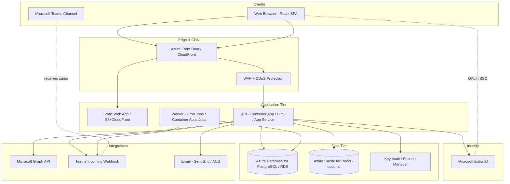
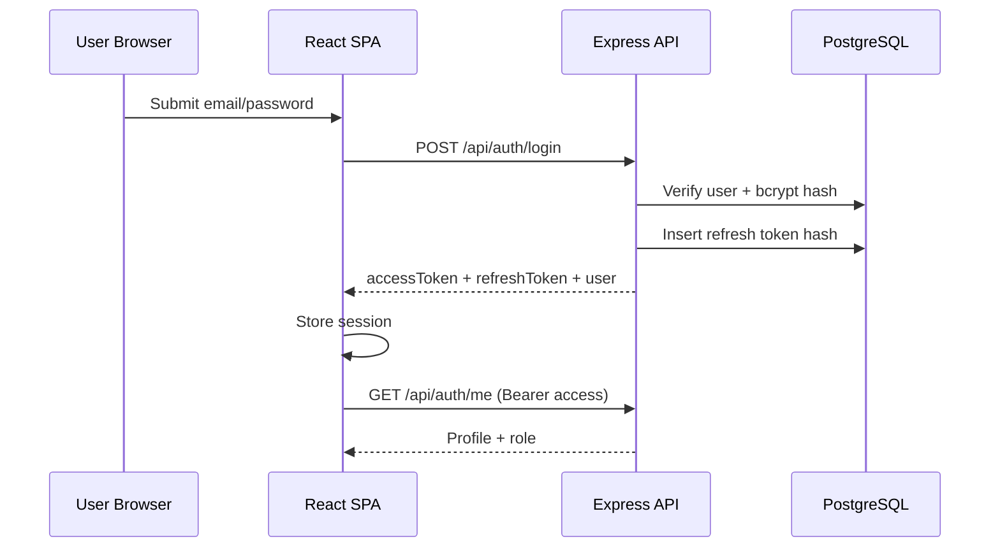
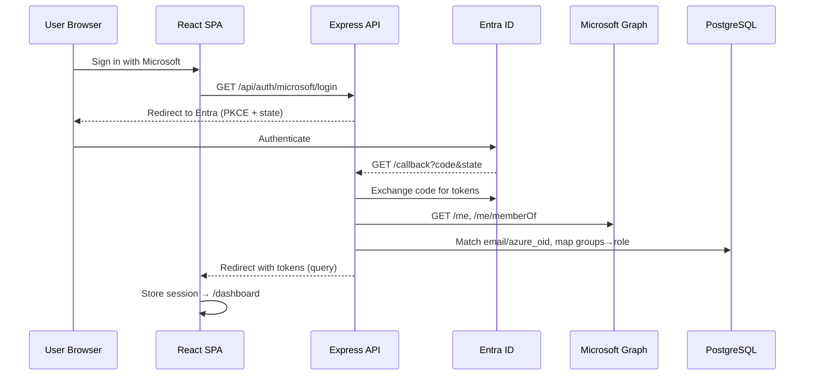
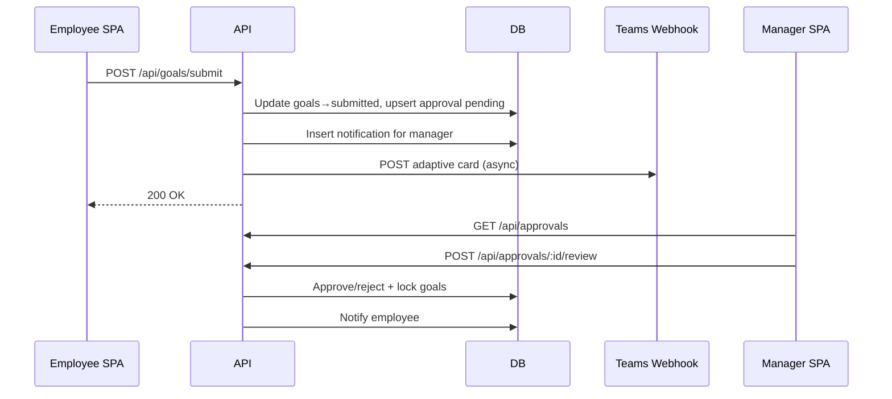
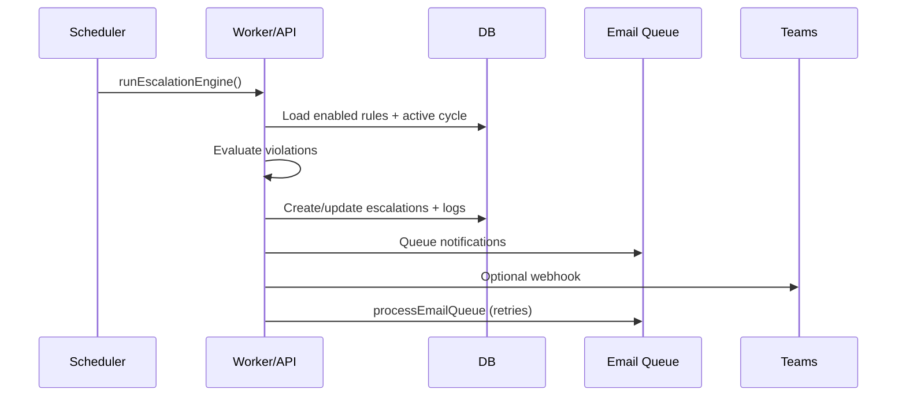
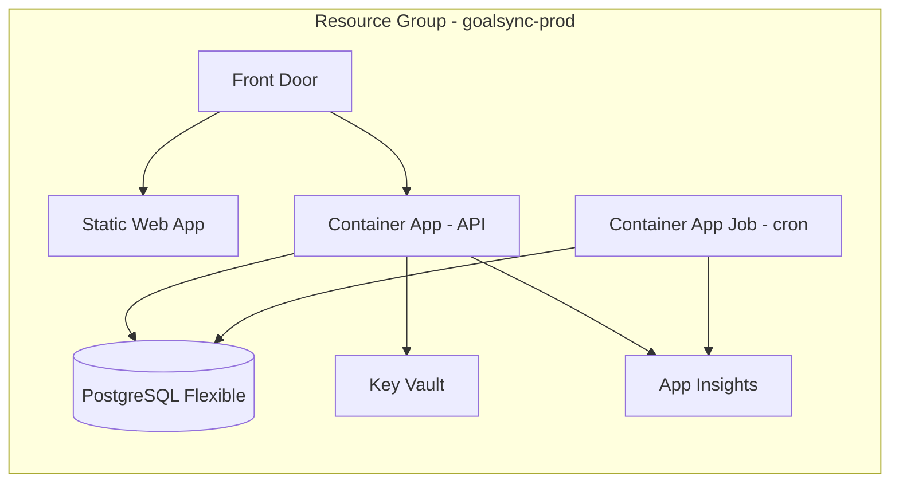
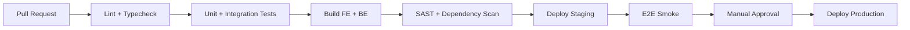

# GoalSync AI — Enterprise System Architecture

**Version:** 2.0  
**Scope:** Goal Setting & Tracking Portal (Employees, Managers, Admin/HR)  
**Primary cloud:** Microsoft Azure (aligned with Entra ID SSO and Teams)  
**Alternate cloud:** AWS mapping included where useful  

---

## 1. Executive summary

GoalSync AI is a multi-tier web application that supports organizational goal lifecycle management: creation, validation, manager approval, quarterly check-ins, analytics, escalations, and HR governance. The system follows a **SPA + REST API + PostgreSQL** pattern with **JWT session management**, optional **Microsoft Entra ID SSO**, and **Teams notifications** for operational alerts.

Design principles:

- **Separation of concerns:** React UI, stateless API, relational data store  
- **Defense in depth:** TLS, RBAC, audit logs, secrets in Key Vault  
- **Horizontal scale:** Stateless API behind load balancer; read replicas for reporting  
- **Cost-aware defaults:** Serverless/managed services for MVP; scale paths documented  

---

## 2. High-level architecture (diagram description)

### 2.1 Logical view

Picture four horizontal bands:

1. **Clients** — Web browsers (employees/managers/admins); Microsoft Teams (incoming webhooks).  
2. **Edge** — CDN + WAF + TLS termination; optional Azure Front Door or AWS CloudFront.  
3. **Application** — Static React host; Node.js API cluster; background workers (escalation cron, email queue).  
4. **Data & identity** — PostgreSQL; Redis (optional cache/sessions); Entra ID; Key Vault / Secrets Manager.

### 2.2 Mermaid — context diagram



### 2.3 Physical deployment (Azure reference)

| Layer | Azure service | Role |
|-------|---------------|------|
| DNS / TLS | Azure Front Door + managed certs | Global entry, path routing `/api/*` → API, `/*` → SPA |
| Frontend | Azure Static Web Apps (or Storage + CDN) | Host Vite/React build |
| API | Azure Container Apps or App Service (Linux) | Express.js, autoscale on CPU/RPS |
| Workers | Container Apps Jobs / Azure Functions (timer) | Escalation engine, email retry |
| Database | Azure Database for PostgreSQL Flexible Server | Primary OLTP; HA zone-redundant in prod |
| Cache | Azure Cache for Redis (Basic C0 dev) | Rate limits, optional session denylist |
| Secrets | Azure Key Vault | DB URL, JWT secrets, Entra client secret, Teams webhooks |
| Identity | Microsoft Entra ID | SSO, group → role mapping |
| Observability | Azure Monitor + App Insights | Logs, metrics, alerts |
| CI/CD | GitHub Actions → ACR → Container Apps | Build, test, deploy |

**AWS equivalent (summary):** CloudFront + S3 (SPA), ALB + ECS Fargate (API), EventBridge + Lambda (cron), RDS PostgreSQL, ElastiCache Redis, Secrets Manager, Cognito or Entra via SAML/OIDC, CloudWatch.

---

## 3. Frontend architecture

### 3.1 Stack and structure

| Concern | Choice |
|---------|--------|
| Framework | React 19 + Vite |
| Routing | React Router (role-gated routes) |
| Styling | Tailwind CSS 4 |
| HTTP | Axios with interceptors (JWT refresh queue) |
| Charts | Recharts (analytics dashboards) |
| Motion | Framer Motion (UX polish) |
| State | React Context (`AuthContext`, `ThemeContext`) |

**Folder pattern (implemented):**

```
frontend/src/
  api/           # Axios client, token refresh
  components/    # ui/, layout/, auth/, analytics/
  context/       # Auth, theme
  pages/         # employee/, manager/, admin/, auth/
  services/      # authStorage, analyticsApi
  constants/     # navigation by role
```

### 3.2 Client responsibilities

- Render role-specific navigation (employee / manager / admin).  
- Enforce route guards before mounting protected layouts.  
- Persist `accessToken`, `refreshToken`, and user profile in `sessionStorage` or `localStorage` (prefer httpOnly cookie pattern in hardened deployments).  
- Deep-link support (e.g. `/manager/approvals?approvalId=5` from Teams cards).  
- Call REST APIs with `Authorization: Bearer <accessToken>`; on 401, refresh once then retry.

### 3.3 Frontend deployment model

- **Build:** `npm run build` → static assets in `dist/`.  
- **Host:** CDN-backed static hosting (Vercel, Azure Static Web Apps, or S3+CloudFront).  
- **Env:** `VITE_API_URL` points to API origin; no secrets in client bundle except public Entra client ID if using MSAL browser (current design uses server-side OAuth redirect).

### 3.4 Quality attributes

| Attribute | Approach |
|-----------|----------|
| Performance | Code-splitting by route; lazy-load admin analytics |
| Accessibility | Semantic HTML, focus states via Tailwind |
| Resilience | Global error toasts; retry on token refresh |
| i18n (future) | Namespace JSON + react-i18next |

---

## 4. Backend architecture

### 4.1 Stack and pattern

| Concern | Choice |
|---------|--------|
| Runtime | Node.js 22 LTS |
| Framework | Express 5 |
| ORM | Prisma → PostgreSQL |
| Auth | JWT (access + refresh rotation), Entra OAuth, optional Firebase |
| Validation | express-validator |
| Jobs | node-cron (escalation engine, email queue) |
| Email | nodemailer / Azure Communication Services |
| Teams | Incoming webhook + Adaptive Cards |

**Layered MVC (implemented):**

```
HTTP Request
  → middleware (auth, validate, errorHandler)
  → routes/*.routes.js
  → controllers/*.js
  → services/*.js (business logic)
  → prisma (data access)
  → PostgreSQL
```

### 4.2 API modules

| Module | Path prefix | Primary consumers |
|--------|-------------|-------------------|
| Auth | `/api/auth` | Login, refresh, Microsoft SSO |
| Goals | `/api/goals` | Employees |
| Approvals | `/api/approvals` | Managers |
| Check-ins | `/api/check-ins` | Employees, managers |
| Analytics | `/api/analytics` | Admin |
| Escalations | `/api/escalations` | Admin, cron |
| Notifications | `/api/notifications` | All roles |
| Teams | `/api/teams` | Admin test, internal hooks |
| Audit | `/api/audit-logs` | Admin |
| Reports | `/api/reports` | Admin export |

### 4.3 Cross-cutting services

- **auditService** — append-only compliance trail.  
- **escalation/engine** — rule evaluation (not submitted, approval pending, check-in overdue); Employee → Manager → HR ladder.  
- **teamsService** — adaptive card payloads with deep links.  
- **emailService** — queued sends with retry.  
- **analyticsService** — aggregations; demo fallback for empty DB.

### 4.4 Worker topology

Run escalation and email processing **outside** the request path:

- **Option A:** Same container with `node-cron` (current MVP).  
- **Option B (prod):** Dedicated Container Apps Job / Lambda on schedule; API remains stateless.  
- **Option C:** Azure Service Bus queue — API enqueues “escalation.run”; worker consumes (best for scale).

---

## 5. Database design

### 5.1 Engine and modeling

- **PostgreSQL 15+** with enums, FK constraints, indexes, and `updated_at` triggers.  
- **3NF** organizational model: roles, departments, users (hierarchy), cycles, goals, approvals, check-ins, audit, notifications, escalations.  
- **Prisma** as schema source of truth; SQL migrations in `database/migrations/` for ops teams.

### 5.2 Core entities (ER description)

```
roles 1──* users
departments 1──* users
users (manager_id self-ref) 1──* users [reports]
performance_cycles 1──* goals
users 1──* goals
goals 1──* check_ins (unique goal_id + quarter)
users 1──1 goal_approvals per cycle
goal_approvals *──1 users [reviewer]
escalation_rules 1──* escalations
escalations 1──* escalation_logs
users 1──* notifications
users 1──* audit_logs
```

### 5.3 Key constraints

| Rule | Enforcement |
|------|-------------|
| Total weightage = 100% | API validation layer |
| Min 10% per goal, max 8 goals | API validation layer |
| One check-in per goal per quarter | `UNIQUE(goal_id, quarter)` |
| One approval record per user per cycle | `UNIQUE(user_id, cycle_id)` |
| Goal status workflow | Enum + service guards |

### 5.4 Indexing strategy

- `goals(user_id, cycle_id)` — employee dashboard.  
- `goal_approvals(status, cycle_id)` — manager queue.  
- `escalations(status, escalated_to)` — open escalations.  
- `notifications(user_id) WHERE NOT is_read` — inbox.  
- `audit_logs(created_at DESC)` — compliance queries (partition by month at scale).

### 5.5 Scaling data tier

| Phase | Pattern |
|-------|---------|
| MVP | Single PostgreSQL instance (Neon / Flexible Server Burstable) |
| Growth | Read replica for analytics/reporting queries |
| Large | Table partitioning on `audit_logs`, `achievement_logs`; archive cold cycles to blob storage |

---

## 6. Authentication flow

### 6.1 Local login (email/password)



- **Access token:** short TTL (15m), signed JWT with `id`, `role`.  
- **Refresh token:** opaque, stored hashed in `refresh_tokens`, rotated on use.

### 6.2 Microsoft Entra ID SSO



### 6.3 Authorization (RBAC)

| Role | Capabilities |
|------|----------------|
| employee | Own goals, check-ins, submit sheet |
| manager | Team goals, approvals, check-in comments |
| admin | Users, analytics, audit, escalations, unlock |

Enforced in `authorize('manager','admin')` middleware after `authenticate`.

---

## 7. API flow (representative journeys)

### 7.1 Goal submission → manager approval → Teams alert



### 7.2 Escalation engine (scheduled)



### 7.3 API conventions

- Base path: `/api`  
- Response: `{ success, data | message }`  
- Errors: HTTP status + `AppError` middleware  
- Idempotency (future): `Idempotency-Key` header on submit/approve  

---

## 8. Deployment architecture

### 8.1 Environments

| Environment | Purpose | Data |
|-------------|---------|------|
| dev | Local Docker Compose / Neon branch | Synthetic seed |
| staging | Pre-prod integration, Entra test app | Anonymized copy |
| prod | Live users | HA PostgreSQL, backups |

### 8.2 Azure reference topology



**Network:** API in VNet integration; PostgreSQL private endpoint; no public DB access.  
**Secrets:** Key Vault references in Container App env vars (managed identity).  

### 8.3 Current hackathon mapping (simplified)

| Component | Current | Production upgrade |
|-----------|---------|-------------------|
| Frontend | Vercel | Azure Static Web Apps + Front Door |
| API | Render | Container Apps / App Service |
| DB | Neon PostgreSQL | Azure PostgreSQL Flexible (HA) |

---

## 9. CI/CD pipeline

### 9.1 Pipeline stages (GitHub Actions)



**Backend job (example):**

1. `npm ci` in `backend/`  
2. `npx prisma validate`  
3. `npm test` (Jest + supertest against test DB)  
4. `docker build -t goalsync-api:${{ github.sha }}`  
5. Push to **Azure Container Registry**  
6. `az containerapp update --image ...`  
7. Run `prisma migrate deploy` as pre-deploy hook  

**Frontend job:**

1. `npm ci && npm run build` in `frontend/`  
2. Upload `dist/` to Static Web Apps / S3  
3. Invalidate CDN cache  

### 9.2 Branch strategy

- `main` → production (protected, required checks)  
- `develop` → staging auto-deploy  
- Feature branches → PR previews (Vercel preview / SWA staging slots)  

### 9.3 Database migrations

- Migrations committed in `database/migrations/` + Prisma  
- **Never** `db push` in prod; use `prisma migrate deploy` in CI  
- Rollback plan: backward-compatible migrations + feature flags  

---

## 10. Security best practices

| Area | Practice |
|------|----------|
| Transport | TLS 1.2+ everywhere; HSTS on Front Door |
| Authentication | Short-lived JWT; refresh rotation; revoke on logout-all |
| SSO | PKCE for Entra; validate `state`; map groups server-side only |
| Authorization | RBAC on every mutating route; row-level checks (managerId) in services |
| Secrets | Key Vault; no secrets in git; rotate quarterly |
| Input | express-validator; Prisma parameterized queries |
| Output | No stack traces in prod; sanitize error messages |
| Headers | Helmet.js: CSP, X-Frame-Options, nosniff |
| Rate limiting | express-rate-limit + Redis store per IP/user |
| Audit | Immutable audit_logs for approvals, unlocks, escalations |
| Dependencies | Dependabot / `npm audit` in CI |
| PII | Minimize logs; mask email in non-prod |
| Teams | Webhook URLs treated as secrets; rotate if leaked |

**Hardening roadmap:** Move tokens to **httpOnly Secure SameSite cookies**; add **CSRF** for cookie mode; enable **WAF** OWASP ruleset on Front Door.

---

## 11. Scalability considerations

| Bottleneck | Mitigation |
|------------|------------|
| API CPU | Horizontal pod autoscaling (Container Apps 2–20 replicas) |
| DB connections | PgBouncer / Prisma connection pool limit per instance |
| Heavy analytics | Read replica + materialized views; cache dashboard JSON 5–15 min |
| Escalation cron | Move to queue workers; shard by department |
| File exports | Async report jobs → blob download link |
| Notifications | Outbox pattern: write DB + queue; worker delivers email/Teams |
| Global users | Front Door edge; single region DB unless multi-region required |

**Target SLOs (enterprise):**

- API availability: 99.9%  
- P95 read latency: &lt; 300 ms  
- P95 write latency: &lt; 800 ms  

---

## 12. Cost optimization

### 12.1 Azure cost levers

| Service | Cost-saving choice | When to upgrade |
|---------|-------------------|-----------------|
| PostgreSQL | Burstable B1ms dev; General Purpose prod | CPU sustained &gt; 60% |
| Container Apps | Min replicas = 0 dev; min 1 prod | Cold start unacceptable |
| Static Web Apps | Free tier dev | Custom domains + SLA |
| Redis | Skip in MVP | Rate limit / session at scale |
| App Insights | Sampling 50% in prod | Full fidelity for incidents |
| Front Door | Single region dev | Global workforce |

### 12.2 Operational savings

- **Neon / serverless Postgres** for dev branches (auto-suspend).  
- **Reserved capacity** (1-year) on PostgreSQL and App Service in steady prod.  
- **Lifecycle policies** on audit export blobs (cool tier after 90 days).  
- **Consolidate** Teams webhooks per channel vs per-user bots until DM required.  

### 12.3 AWS cost mirror

- Fargate Spot for non-critical workers  
- RDS Reserved Instances  
- S3 Intelligent-Tiering for report archives  
- CloudWatch log retention 30 days  

**Estimated MVP (500 users):** ~$150–400/month Azure (API + DB + Front Door light) excluding Entra/Teams licenses.

---

## 13. Component communication matrix

| From | To | Protocol | Payload |
|------|-----|----------|---------|
| Browser | CDN/SPA | HTTPS | Static JS/CSS |
| Browser | API | HTTPS REST JSON | JWT Bearer |
| API | PostgreSQL | TCP 5432 TLS | SQL via Prisma |
| API | Entra | HTTPS OAuth2 | code, tokens |
| API | Graph | HTTPS REST | user, groups |
| API | Teams webhook | HTTPS POST | Adaptive Card JSON |
| API | SMTP/ACS | HTTPS/TLS | Email MIME |
| Cron worker | PostgreSQL | TCP 5432 | Batch reads/writes |
| CI/CD | ACR | HTTPS | Docker image |
| CI/CD | Container Apps | Azure API | Deploy manifest |

---

## 14. Observability and operations

- **Structured logging:** JSON logs with `requestId`, `userId`, `route`, `durationMs`.  
- **Metrics:** RPS, 4xx/5xx, DB pool wait, cron last success.  
- **Alerts:** Error rate &gt; 1%, DB CPU &gt; 80%, escalation job missed schedule.  
- **Runbooks:** Failed migration, token secret rotation, Teams webhook rotation.  
- **Backups:** PostgreSQL PITR 7–35 days; test restore monthly.  

---

## 15. Evolution roadmap

| Phase | Deliverable |
|-------|-------------|
| MVP | Monolith API + cron + Neon + Vercel (current) |
| v1.1 | Entra SSO + Teams cards (implemented) |
| v2 | Message queue workers, read replica analytics |
| v3 | Teams Bot (1:1 manager DMs), Power BI embedding |
| v4 | Multi-tenant B2B if selling to multiple enterprises |

---

## 16. Related repository artifacts

| Artifact | Location |
|----------|----------|
| SQL schema | `database/schema.sql` |
| Prisma models | `backend/prisma/schema.prisma` |
| API reference | `backend/API.md` |
| Entra / Teams setup | `docs/AZURE_ENTRA_TEAMS.md` |
| Escalation migration | `database/migrations/002_escalation_engine.sql` |
| Product requirements | `CLAUDE.md` |

---

*This document describes the target enterprise architecture for GoalSync AI. Implementations may vary by environment; treat Azure services as the recommended production path when using Microsoft 365 and Entra ID.*
